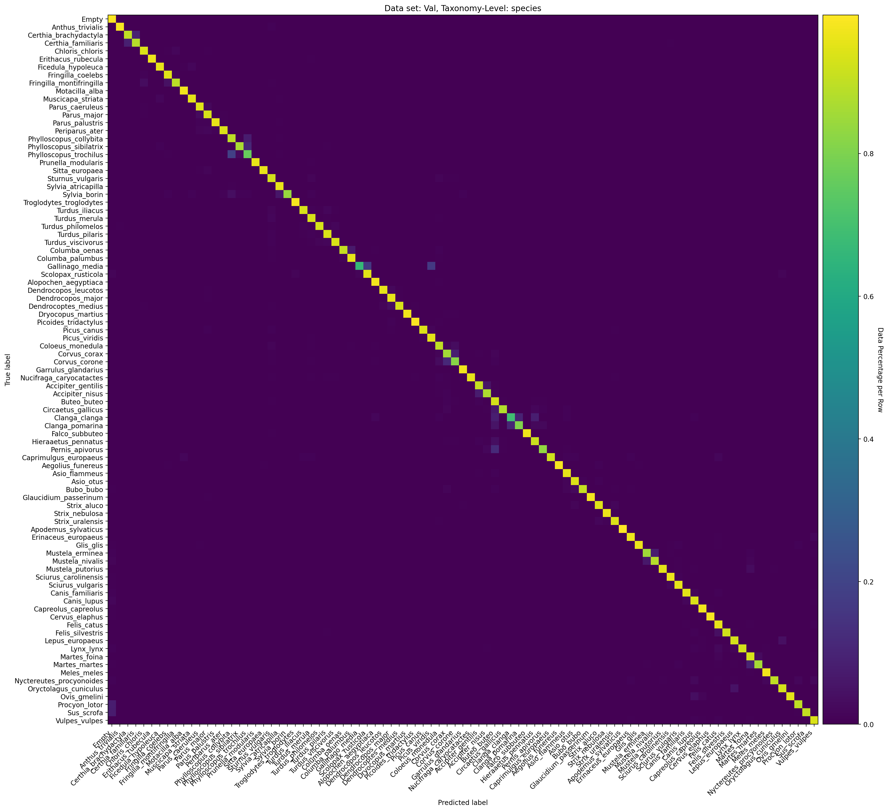
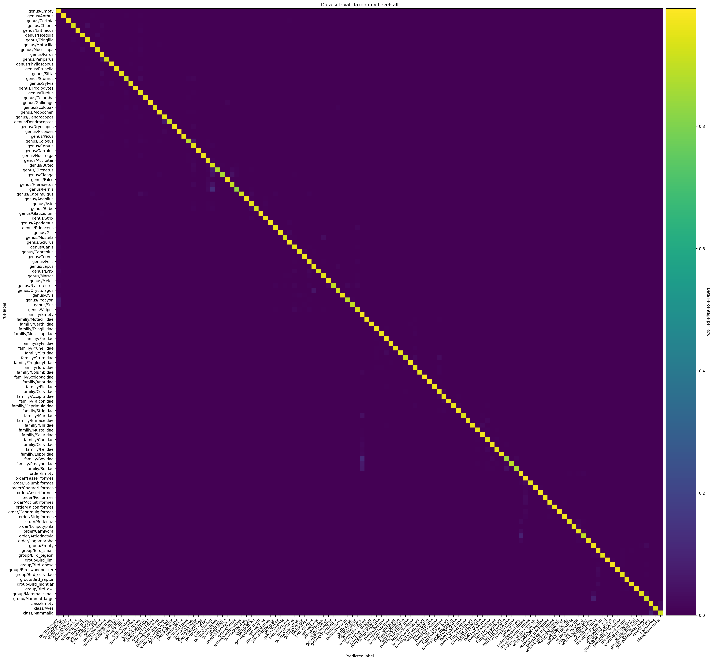
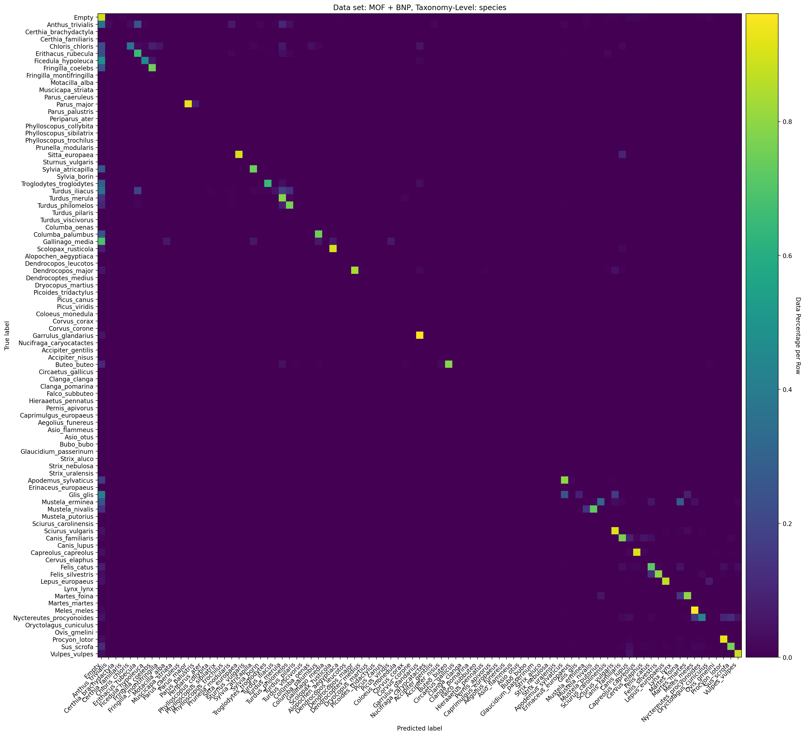

# Evaluation

## The calculated Confusion Matrices

The following images show the confusion matrices for our best ConvNeXt models. We averaged the prediction counts of the models trained with different data splits.

### Species Classification Models
The matrices for the models trained only on species classification.

### Taxonomic Classification Models
The matrices for the taxonomic classification models.

