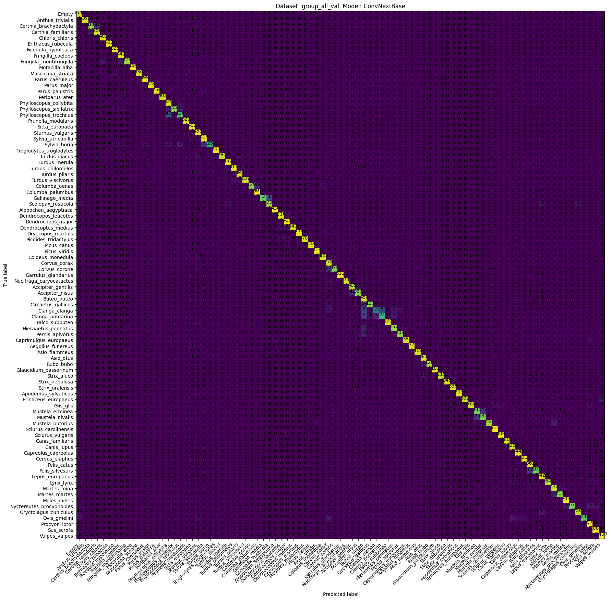
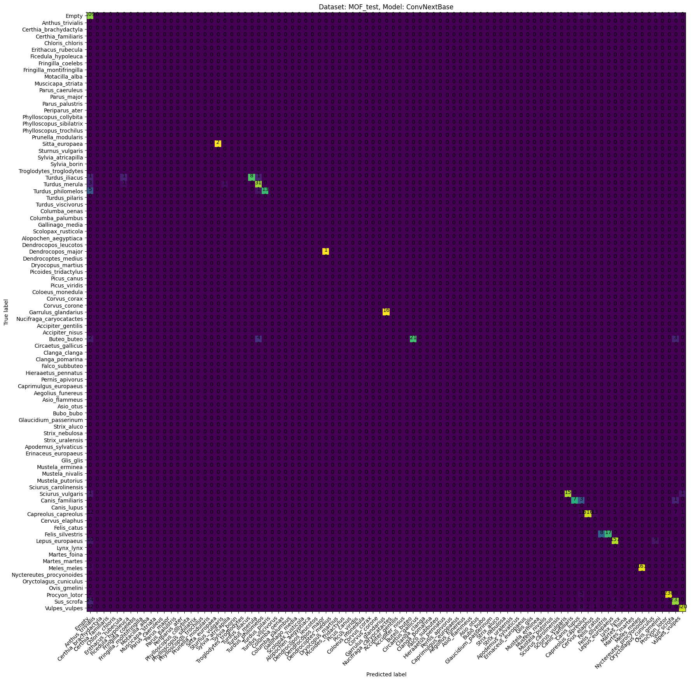
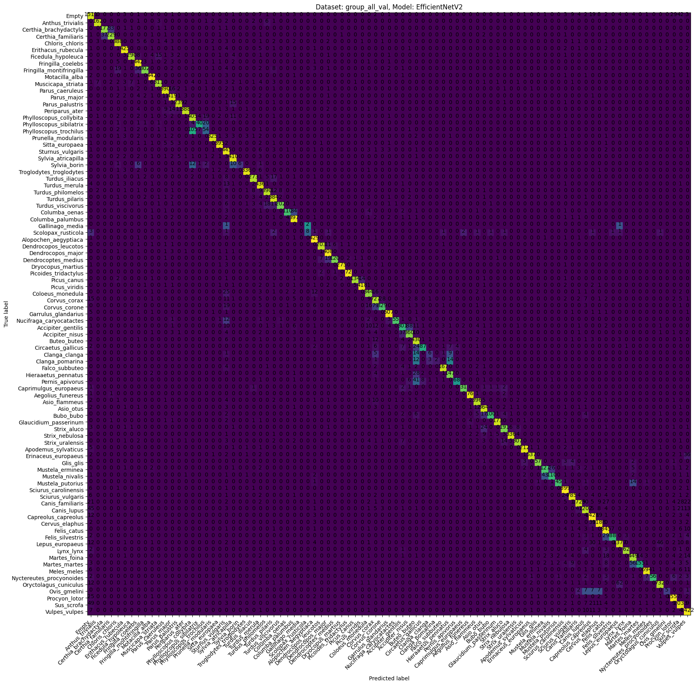
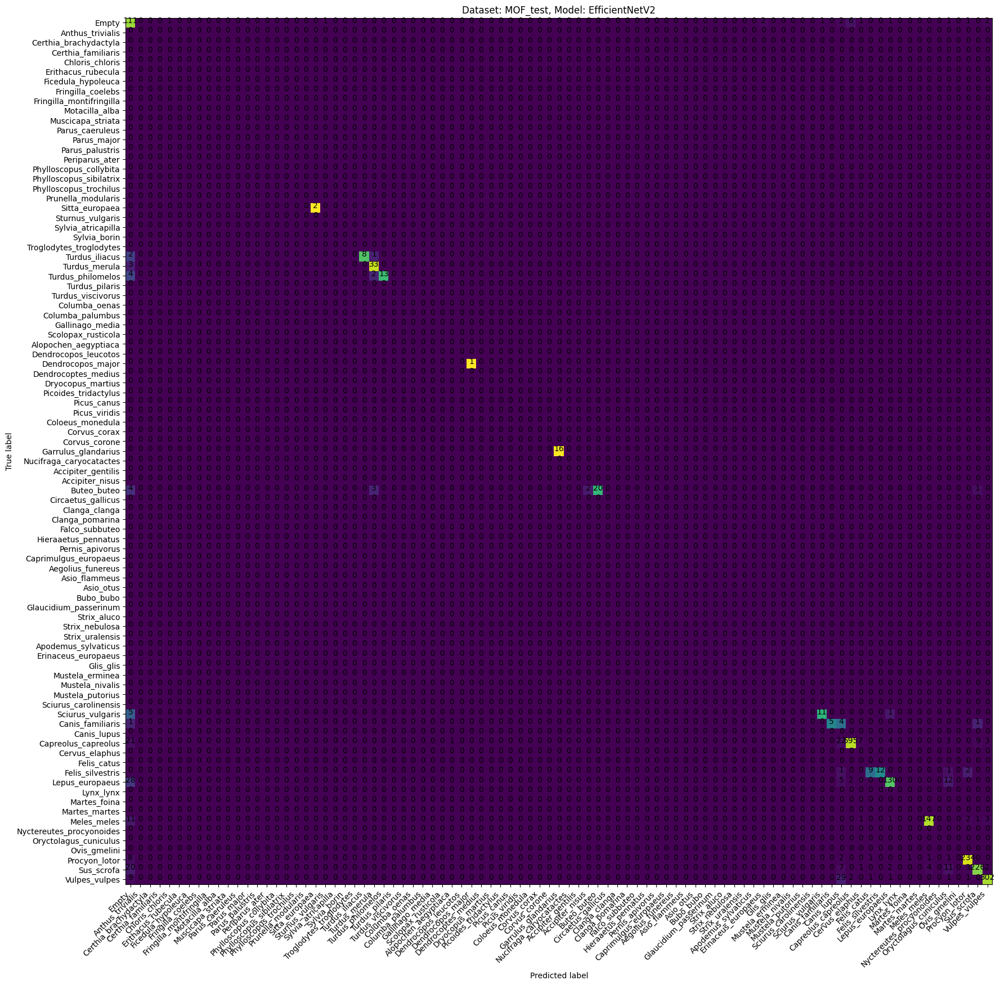

# Metrics

## Metrics on the validation and test data sets

|                  |   val_all_Accuracy |   val_all_Top3Acc |   val_all_Top5Acc |   val_all_mAP |   test_all_Accuracy |   test_all_Top3Acc |   test_all_Top5Acc |   test_all_mAP |
|:-----------------|-------------------:|------------------:|------------------:|--------------:|--------------------:|-------------------:|-------------------:|---------------:|
| ConvNext_Base    |           0.933347 |          0.978244 |          0.986155 |      0.956749 |            0.903033 |           0.973346 |           0.982996 |       0.950346 |
| EfficientNetV2_M |           0.892207 |          0.966624 |          0.978936 |      0.89477  |            0.857537 |           0.960018 |           0.983915 |       0.94131  |

## The calculated Confusion Matrices

### ConvNextBase

### EfficientNetV2M

