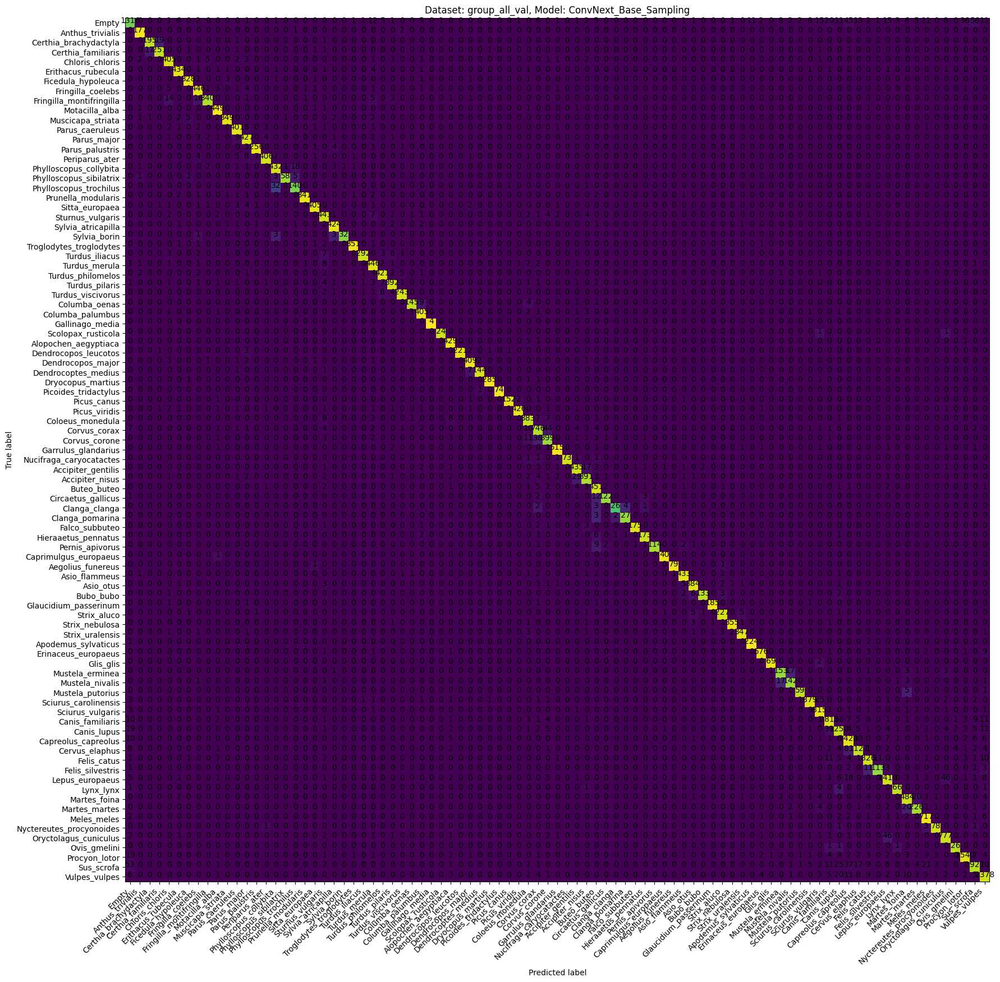

# Metrics

## Metrics on the validation and test data sets

The following table shows the metrics we calculated on our validation and test data sets for all trained models.

| Architecture     | Model Type  | val_Accuracy | val_Top3Acc | val_Top5Acc |  val_mAP |  val_mCA |  val_mF1 | test_Accuracy | test_Top3Acc | test_Top5Acc | test_mAP | test_mCA | test_mF1 |
|:-----------------|:------------|-------------:|------------:|------------:|---------:|---------:|---------:|--------------:|-------------:|-------------:|---------:|---------:|---------:|
| EfficientNetV2_M | all         |     0.918389 |    0.974239 |    0.983732 | 0.964226 | 0.998166 | 0.920571 |      0.84421  |     0.940717 |     0.966452 | 0.927425 | 0.996499 | 0.693079 |
| ConvNext_Base    | all         |     0.930281 |    0.977724 |    0.986229 | 0.968918 | 0.998433 | 0.930185 |      0.842371 |     0.944393 |     0.971967 | 0.938788 | 0.996458 | 0.76217  |
| ConvNext_Base    | onlyBirds   |     0.943272 |    0.979791 |    0.9864   | 0.975206 | 0.998227 | 0.938642 |      0.922449 |     0.95102  |     0.967347 | 0.985448 | 0.997577 | 0.916854 |
| ConvNext_Base    | onlyMammals |     0.927714 |    0.981691 |    0.991652 | 0.971217 | 0.99444  | 0.925608 |      0.860747 |     0.948569 |     0.972829 | 0.936621 | 0.989288 | 0.562767 |
| ConvNext_Base    | noAug       |     0.915126 |    0.971964 |    0.982644 | 0.957103 | 0.998093 | 0.912969 |      0.806066 |     0.926011 |     0.960018 | 0.938645 | 0.995642 | 0.799195 |
| ConvNext_Base    | noCrop      |     0.919375 |    0.975037 |    0.985155 | 0.960811 | 0.998188 | 0.912479 |      0.771272 |     0.875572 |     0.905764 | 0.755943 | 0.99486  | 0.787209 |
| ConvNext_Base    | noFilt      |     0.773283 |    0.858445 |    0.889936 | 0.861310 | 0.994905 | 0.80002  |      0.542779 |     0.723622 |     0.789723 | 0.834606 | 0.989725 | 0.363544 |
| ConvNext_Base    | noSampling  |     0.933347 |    0.978244 |    0.986155 | 0.956749 | 0.998502 | 0.911432 |      0.903033 |     0.973346 |     0.982996 | 0.950346 | 0.997821 | 0.854996 |

## The calculated Confusion Matrices

We calculated confusion matrices for our models to analyze how the unique classes performed.

### ConvNextBase

### EfficientNetV2M

